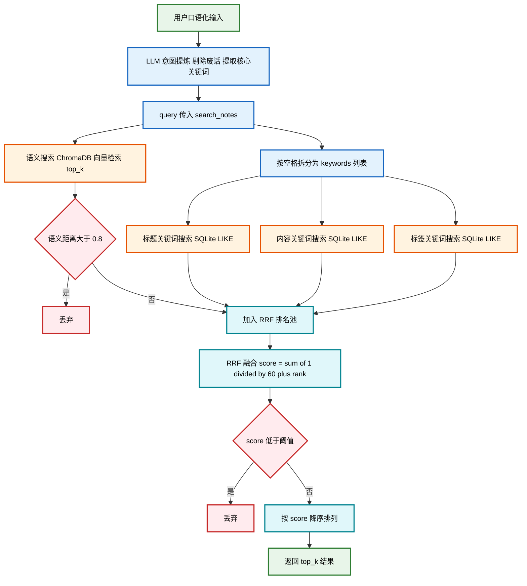

# 算法与模型

**1. 实现笔记语义向量化与搜索时，使用了 `paraphrase-multilingual-MiniLM-L12-v2` 模型**

ChromaDB 默认嵌入模型为 `all-MiniLM-L6-v2`，该模型仅在英文语料上训练，对中文文本的语义理解能力较弱。本项目的笔记内容以中文为主，因此将其替换为 `paraphrase-multilingual-MiniLM-L12-v2`
(——该模型基于 Transformer 架构，在 50+ 种语言的平行语料上训练，能将中英文文本映射为 384 维稠密向量，实现跨语言的语义相似度计算。通过计算查询与笔记向量之间的距离，实现"意思相近即可命中"的语义搜索，而非依赖关键词完全匹配。)

**2. 实现混合搜索结果融合排名时，使用了 RRF（Reciprocal Rank Fusion）算法**

RRF 是一种无参数的排名融合方法，公式为 score(d) = Σ 1/(k + rank_r(d))（k=60）。本项目将语义搜索、标题匹配、标签匹配三路结果分别排名后，通过 RRF 融合为统一排名，避免了对各路得分进行归一化的复杂性,实现了对于语义、标题、标签的综合考察。

**3. 实现自动标签提取时，使用了 jieba.analyse 的 TF-IDF 算法**

TF-IDF（词频-逆文档频率）衡量一个词在当前文档中的重要程度。jieba.analyse.extract_tags 在分词基础上计算 TF-IDF 分数，并通过 allowPOS 参数过滤出名词、动词等实义词，自动为笔记生成关键词标签，无需用户手动输入。

---

# 创新性

## 功能创新

**1. 知识盲区分析（knowledge_gap）**

不只是查找已有知识，而是主动分析知识库对某主题的覆盖范围，找出尚未记录的知识点，引导用户发现学习盲区。

**2. 概念关联发现（connect_ideas）**

检索两个概念的相关笔记，引导 LLM 分析它们的联系、区别和结合方式，帮助用户建立知识之间的横向连接，而不只是孤立存储。

**3. 每日知识复习（daily_review）**

自动检索近期笔记生成复习提示词，形成"记录→复习→巩固"的完整学习闭环，将被动存储变为主动学习。

**4. 网页内容直接入库（fetch_url + add_note）**

支持抓取网页正文，用户确认后一键存入知识库，实现从"浏览网页"到"沉淀知识"的无缝衔接。

## 方法创新

**1. 多路混合搜索 + RRF 融合排名**

将语义搜索、标题匹配、内容匹配、标签匹配四路结果用 RRF 算法融合，兼顾精确匹配和语义理解，优于单一搜索方式。

**2. 自动标签提取**

添加笔记时自动用 jieba TF-IDF 提取关键词作为标签，降低使用门槛，标签同时参与后续搜索排名，形成正向反馈。

**3. 意图提炼：LLM 预处理用户查询**

传统搜索系统直接以用户原始输入作为查询，口语化表达（如"帮我找找之前记的那个关于 Python 的东西"）会引入大量噪声，降低语义匹配和关键词检索的精度。本项目在 `search_notes` 与 `summarize_topic` 工具的调用约定中，要求 LLM 在调用前先将用户意图提炼为核心技术关键词，剔除口语化废话，仅保留实义词后再传入搜索层。这一设计将 LLM 的自然语言理解能力与向量/关键词检索解耦，使搜索质量不再受用户表达习惯影响。

# 混合搜索流程图

# 项目难点

最大难点是混合搜索的设计：

引入双重过滤机制的原因在于：若知识库笔记较少，向量检索和关键词匹配会强制返回 top_k 条结果，导致末尾几条实际上与查询无关的笔记也被纳入。为此，本项目在 RRF 融合后增加了两道过滤：语义距离阈值（MAX_SEMANTIC_DISTANCE）过滤语义相关性不足的向量结果，RRF 分数阈值（MIN_RRF_SCORE）过滤整体相关性不足的笔记。两个阈值均经过反复调试确定，以在召回率与准确率之间取得平衡。

第二个难点是自动生成标签
